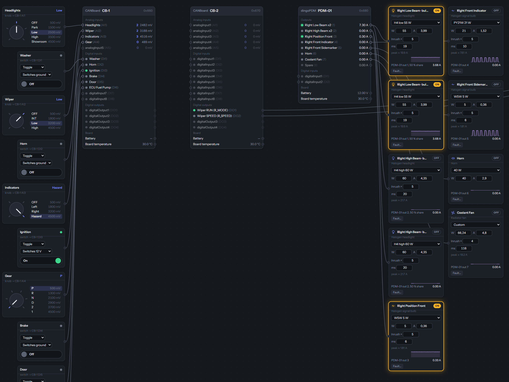
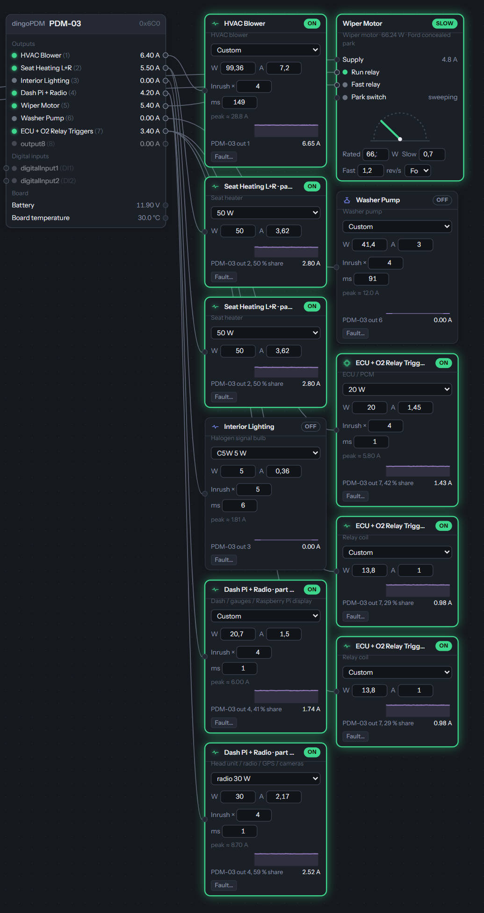
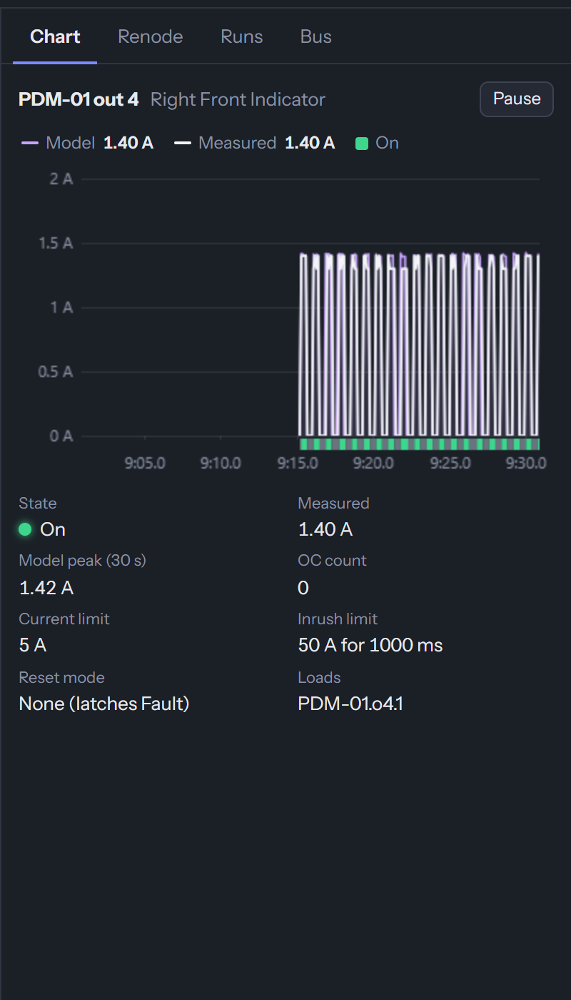
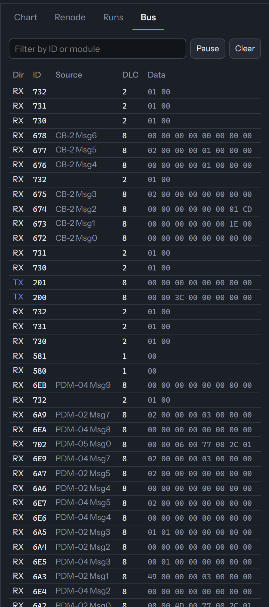
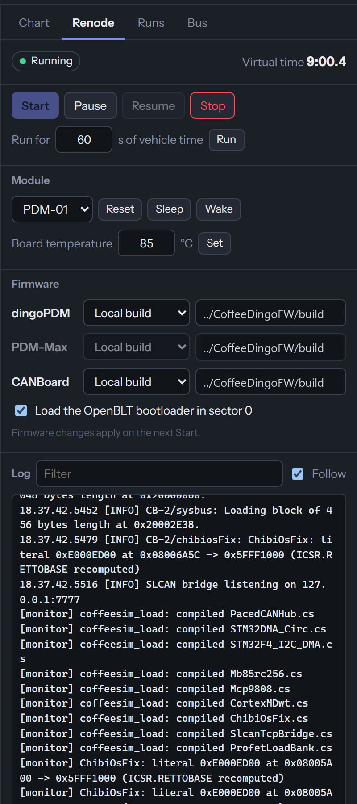

# CoffeeDingoSim

**A firmware simulator for a whole dingoPDM / CANBoard vehicle.** The real, unmodified firmware images
([CoffeeDingoFW](https://github.com/Coffee0297/CoffeeDingoFW) `.elf` files, the same ones you flash) run in
[Renode](https://renode.io) on emulated STM32s, one machine per module, all on one virtual CAN bus. Around them
sits the electrical side of the car: bulbs, motors, pumps, heaters, coils and wiper motors with realistic
current curves and inrush, switches, rotary knobs, keypads, a PWM signal source, an engine and a battery.
You operate the car on screen and watch every output switch, trip and recover exactly as the firmware decides.

dingoConfig (this [fork](https://github.com/Coffee0297/CoffeeDingoConfig) or the original) connects to the
simulated bus as if a USB-CAN adapter were plugged into the car, so you can configure, deploy, write Lua,
read logs and even **flash firmware over CAN** against the simulator, then take the same project to the real
vehicle.


*A full vehicle: five dingoPDMs and two CANBoards running v5.5.108, about 40 loads and 10 switches and knobs.*

## What it can do

- **Run the real firmware**: no re-implementation of the logic. Conditions, flashers, timers, Lua, sleep, CAN
  broadcasts, current limits and trip resets all come from the firmware itself, cycle for cycle.
- **Model the loads**: each output drives a component from the library (halogen and LED lighting, fans,
  fuel/water/washer pumps, blowers, windows, seat and window heaters, glow plugs, relay and solenoid coils,
  starter, horn, ECUs, radios, amplifiers, or a custom CSV curve). The Profet current sense on each output reads
  the model's current, including inrush, so the firmware's protection sees what it would see in the car.
- **Inject faults**: burnt bulb, blocked pump, short circuit, broken wire, loose connector, corroded contact,
  wrong (double-wattage) bulb. Watch the output trip, retry and latch.
- **Drive the inputs**: toggle / momentary / 3-position switches to ground or 12 V on any digital input, rotary
  knobs on a CANBoard analog input (resistor-ladder positions), Blink Marine / Grayhill keypads on the bus, a
  CAN generator (signals from a DBC or raw frames), and a PWM source (duty % and frequency) on a digital input.
- **Vehicle physics where it matters**: a battery with internal resistance and an alternator (voltage sags
  under load and every module sees it), an engine (off / ignition / crank / run, RPM, coolant), a wiper motor
  with run / speed relays and a park switch, including the Ford concealed-park variant.
- **See everything**: a live chart of any output (model vs firmware-measured current, state), the whole CAN bus
  decoded by module and message, the Renode log, virtual time.
- **Control time**: start, pause, resume, run for exactly *n* seconds of vehicle time, reset / sleep / wake a
  single module, set a module's board temperature.
- **Record and replay runs**, compare a run against a golden one, and let an AI agent drive all of it over MCP.

| Front of the car: knobs and switches on CB-1, headlights on PDM-01 | The cabin on PDM-03, with a Ford concealed-park wiper |
|---|---|
|  |  |

| Chart: an indicator flashing, model vs measured | Bus: every frame, by module | Renode: control and firmware |
|---|---|---|
|  |  |  |

## Run

Needs Node 22+ and the firmware `.elf` files (a CoffeeDingoFW build in `../CoffeeDingoFW/build`, or pick
files in the Renode panel).

```
npm install
npm run build        # Svelte UI -> app/dist
npm start            # http://localhost:8787  (downloads Renode into cache/renode on first start)
```

`RENODE_EXE` / `RENODE_DIR` point at an existing Renode instead (see
[`tools/install-renode.md`](tools/install-renode.md)). The default scene is `scenes/example` (two dingoPDMs and a
CANBoard, project `scenes/example/example-vehicle.json`); pick another with `SIM_SCENE=<name>`.

## Guide

### 1. Build your vehicle from a dingoConfig project
1. **Load…** a dingoConfig project `.json` (e.g. `scenes/example/example-vehicle.json`, or your own).
2. **Populate from project** creates one node per module at its base ID, and a load for every named output and a
   switch or knob for every named input, matched *by name* (a "Fuel Pump" output gets a fuel-pump load).
3. Adjust what Populate guessed: pick a component and variant on each load (or type W / A), drag from the
   component list on the left, wire inputs and outputs by dragging between the dots. **Arrange** tidies the canvas.
4. **Save** the scene (`scenes/<name>/scene.sim.json`).

### 2. Start the firmware
**Renode ▸ Start**. Each module boots its firmware with its saved config (FRAM / flash images under the scene
folder, so settings survive restarts like on a real module). *Load the OpenBLT bootloader in sector 0* boots the
modules through the CAN bootloader, so flashing over CAN works.

### 3. Connect dingoConfig
- **This fork:** adapter `SLCAN`, port `tcp://127.0.0.1:7778` (the *Sim* preset), 500K.
- **Original dingoConfig:** adapter `SLCAN` on a virtual COM pair: install the
  [signed com0com installer](https://alge-timing.com/alge/download/driver/Com0ComSetup.exe) (see
  [`tools/install-com0com.md`](tools/install-com0com.md)), start the sim with `SIM_BRIDGE=tcp:7778,serial:COM5`
  and point dingoConfig at the other end of the pair.

Then **Add from CAN**, **Deploy** your project to every module and **Burn**. Everything dingoConfig does on the
car works here: live output cards, signals, Lua upload, trip logs, CAN logs, flash over CAN.

### 4. Drive the car
Click switches and turn knobs on the canvas, set the engine to crank / run, change the battery voltage, set a
PWM source's duty. Click any load or module output to chart it. Typical checks:

| You want to check | Do this |
|---|---|
| Headlight / indicator logic | Turn the knobs, watch the outputs and the chart (a flasher shows a square wave) |
| A fuel pump prime, after-run fan, delayed off | Toggle ignition, watch the timing on the chart in virtual time |
| Current limits and retry | **Fault…** on a load ▸ short circuit / blocked pump, watch it trip, retry, latch |
| Open-load and warning detection | Fault ▸ broken wire or burnt bulb |
| Low-voltage behaviour | Lower the battery voltage or its internal resistance, crank the engine |
| PWM input rules (on at x %, follow duty) | A PWM source on the digital input, sweep its duty |
| Sleep / wake | Ignition off and wait, or Renode ▸ Sleep / Wake on one module |
| Wiper park | Turn the wiper knob off mid-sweep: the motor runs on until the park switch |
| A firmware change | Rebuild the `.elf`, Renode ▸ Stop / Start, or flash the `.srec` over CAN from dingoConfig |

### 5. Record, replay and automate
**Runs** records a run (stimulus and every frame) and replays it; `sim_golden_diff` compares a run against a
recorded golden one, which is how a firmware change is regression-tested. An MCP server at
`http://127.0.0.1:8787/mcp` exposes the sim to an AI agent (`sim_load_project`, `sim_populate`, `sim_switch`,
`sim_rotary`, `sim_pwm`, `sim_set_fault`, `sim_engine`, `sim_battery`, `sim_renode`, `sim_state`,
`sim_record`, `sim_replay`, …). Together with dingoConfig's MCP server an agent can configure a module and
check the result on the simulated car in one loop.

## Limits

- **Speed:** seven modules run at about 0.3–0.55× real time on a desktop PC; time is virtual, so the logic is
  still exact (watch *Virtual time*, not the wall clock).
- **Timing resolution:** Renode advances in quanta (1 ms, or 250 µs when a scene has a PWM source; override
  with `globals.quantumUs`). A PWM input's duty is measured to about ±quantum × frequency (±2.5 % at 100 Hz).
- **Electrical model:** loads are current-vs-time curves on a battery with internal resistance, not a circuit
  solver; wiring resistance, ground offsets and EMC are not modelled.
- Renode quirks found and worked around are listed in [`renode/README.md`](renode/README.md#sharp-edges-found-all-fixed-in-these-files).

File formats and protocols (scene, load bank, SLCAN bridge, WebSocket) are in
[`docs/interfaces.md`](docs/interfaces.md).

## Layout

| Path | What |
|---|---|
| `server/` | Node: web/ws server, Renode launcher + monitor, bank and bridge links, DBC telemetry decode, record/replay, MCP |
| `app/` | Svelte 5 + Svelte Flow canvas, charts, Renode and runs panels |
| `lib/` | pure JS shared by all: component library and curve shapes, pre-check, DBC, SLCAN, param protocol, project import, populate, engine, battery |
| `renode/` | platform descriptions, C# models (load bank, SLCAN bridge, MCP9808, OTG stub), script templates, DBCs, bring-up tools in `renode/test/` |
| `scenes/` | scene files (`scenes/example`: example project and scene; `renode/test/e2e_vehicle.mjs` records its golden run); per-module FRAM/flash images and recorded runs are generated here |
| `tools/` | install notes, CI script |

Tests: `npm test` (Node's built-in runner, no extra dependencies). End-to-end run against real Renode and
firmware: `node renode/test/e2e_vehicle.mjs` (firmware from `SIM_FW_DIR`, default `../CoffeeDingoFW/build`).
